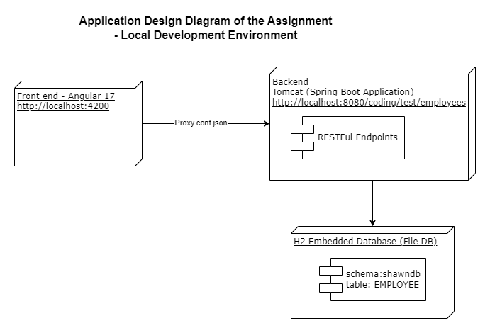
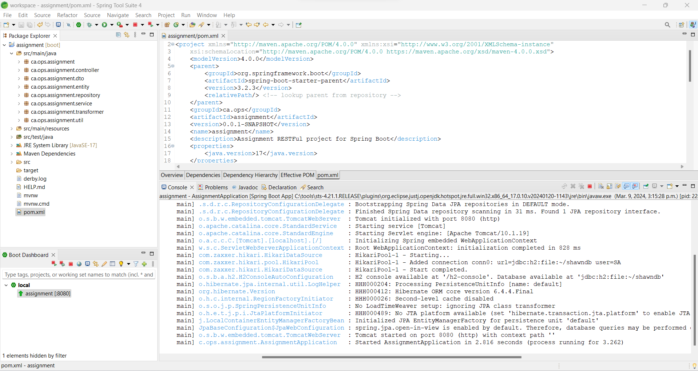
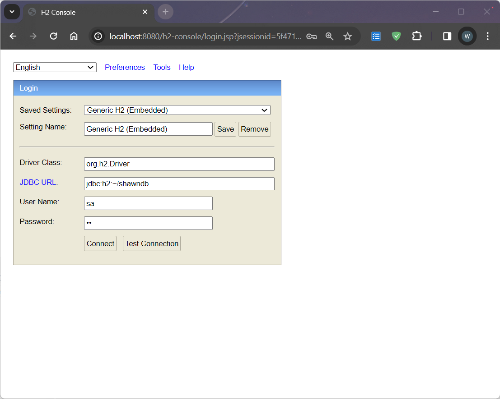
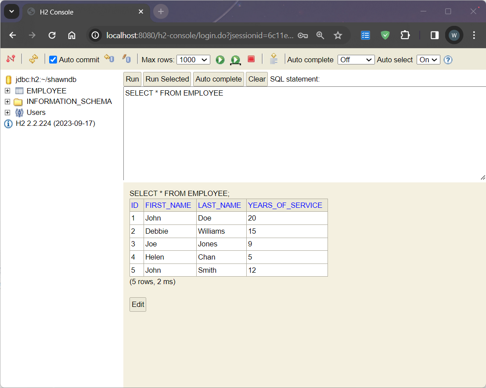
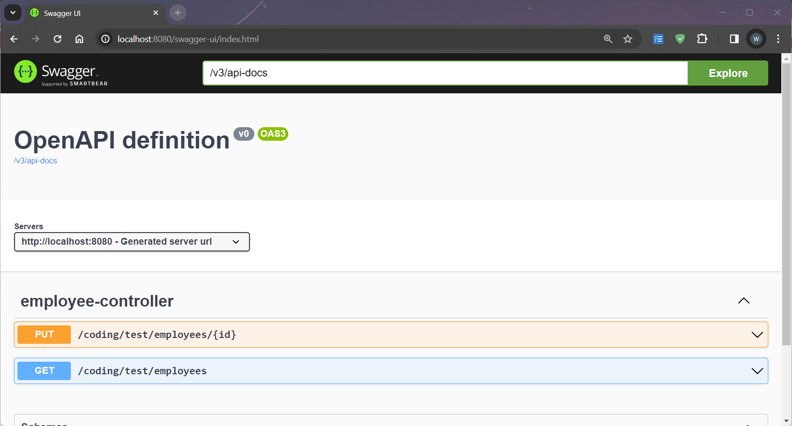
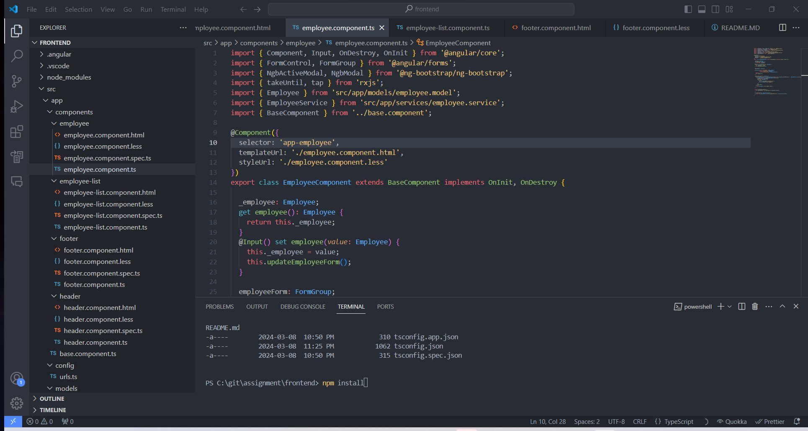
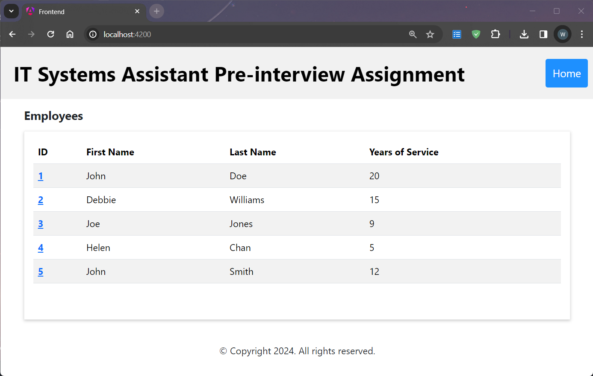
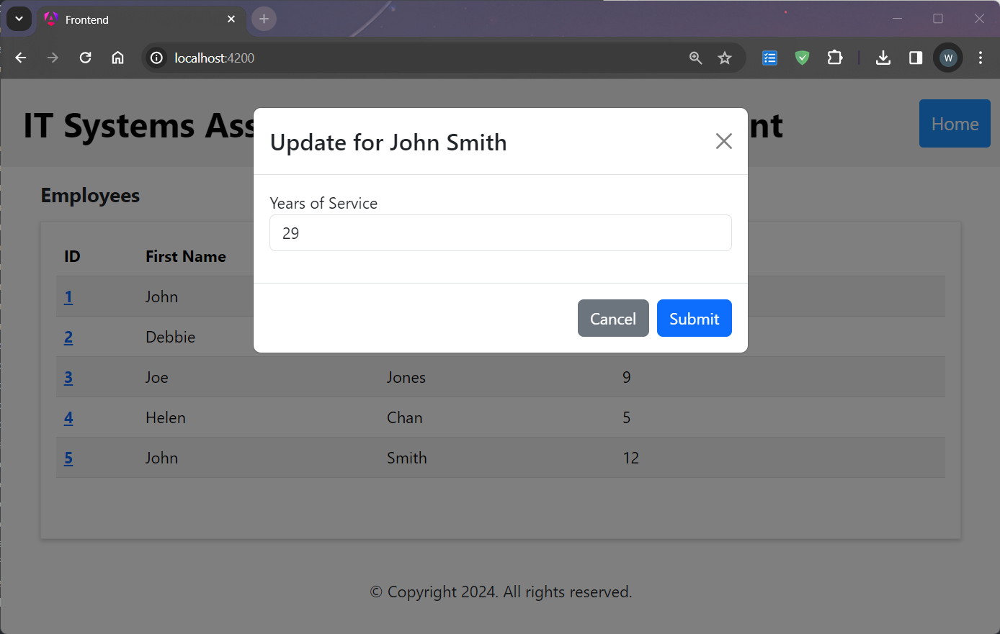
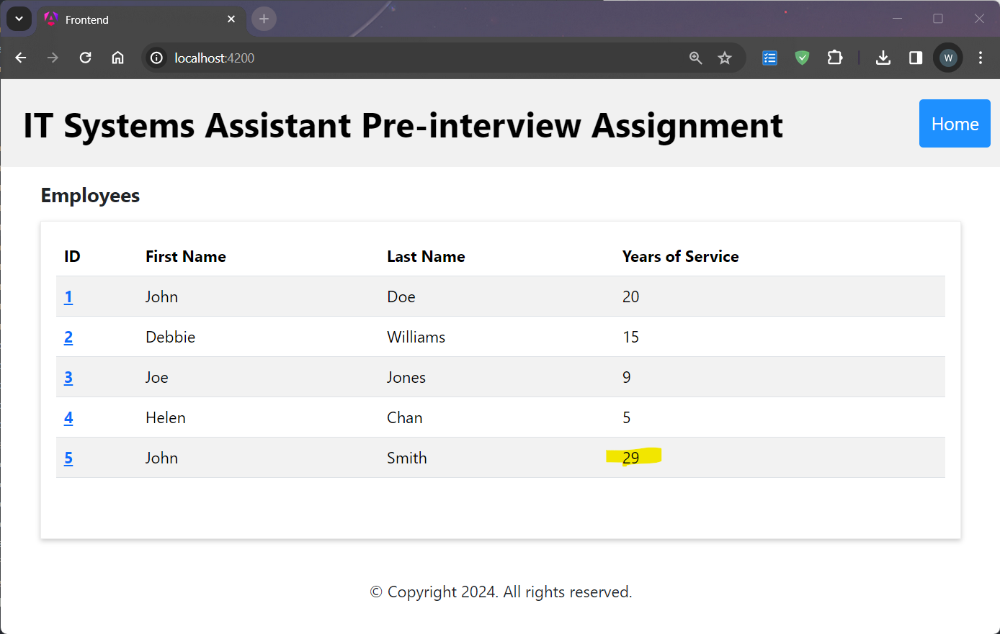

# Project Title

IT Systems Assistant Pre-interview Assignment

## Application Design


## Tech Stack

### Database
* H2 Embedded Database

### Backend RESTFul Service Application
* Springboot 3.2.3 (Embedded Tomcat)
* Java 17
* Swagger 3 (API Documentation)
* JPA (ORM)
* Maven (Build Automation )

### Frontend Single Page Application
* Angular 17.2.0
* Bootstrap 5.3.2 (UI and CSS Framework)
* RxJS 7.8.0 (Reactive Extensions Library for JavaScript)

## Local Development Installation

### Prerequisites
Please download and install the following tools
* Spring Tools 4 for Eclipse (or choose different according to your operating system): https://cdn.spring.io/spring-tools/release/STS4/4.21.1.RELEASE/dist/e4.30/spring-tool-suite-4-4.21.1.RELEASE-e4.30.0-win32.win32.x86_64.self-extracting.jar
* NodeJS (^18.13.0 || ^20.9.0): https://nodejs.org/dist/v20.11.1/node-v20.11.1-x64.msi
* Angular CLI 17.2.0+
  ```bash
  npm i @angular/cli
  ```
* Visual Studio Code: https://code.visualstudio.com/

### Instalation and Running Local DEV Environment
Step 1. Launch STS (Spring Tools 4) and import as "Existing Maven Projects" from backend folder, give project name as "Assignment"

Step 2. Right click the imported project -> Maven -> Update Project. This step will download all the dependencies specified in the pom.xml including Java 17 and H2 Database

Step 3. At the bottom left corner of STS, Boot Dashboard -> local -> Assignment, right click this imported project, click 'Start' from the pop-up window.

Step 4. Embedded tomcat should start on port 8080, Assignment application should also start without problems.


Step 5. Springboot application also create H2 database as well as schema, table and populate data according to the following configuration files. "shawndb' database will be created at the first time you start tomcat. Employee table and data will be recreated/populated every time you (re)start the Tomcat server.
* assignment/src/main/resources/application.properties
* assignment/src/main/resources/schema.sql
* assignment/src/main/resources/data.sql

Step 6. You can go to: http://localhost:8080/h2-console with the following entry to enter database admin console,
*  URL: jdbc:h2:~/shawndb
*  User Name: sa
*  Password: sa




Step 7. Swagger has been wired up to the backend applicaiton as API document tool and can be access at once server is up and running. At this point, backend RESTFul services are ready.


Step 8. Launch VS code and import frontend folder. Open terminal and run the following command to pull all the dependencies (node_modules),
```bash
  npm install
```


Step 9. Run the follwing command to start front end angular application, and access it via http://localhost:4200
```bash
  npm start
```
## Use Application

Step 1. Go to http://localhost:4200, you will see a SPA application with typical header, content and footer layout. The application consumes backend endpoint and retreive all employees and list them in the content section.


Step 2. Id field is clickable, click id: 5 and a dialog will display with the name of uses to be updated as title. User can cancel edit action by click close cross 'X' or the cancel button.


Step 3. Change value of 'Years of Service' and click 'Submit' button, the frondend application will consume backend RESTFul service and update the record of user to database. The dialog will be closed and the successful data update will trigger refreshing employee list with updated data.




### Once again, I appreciate the oppertunity!